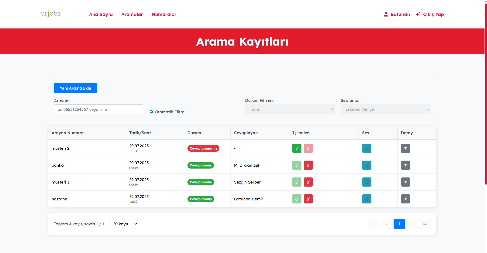
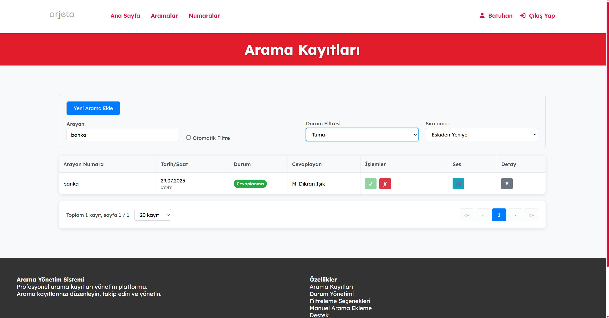
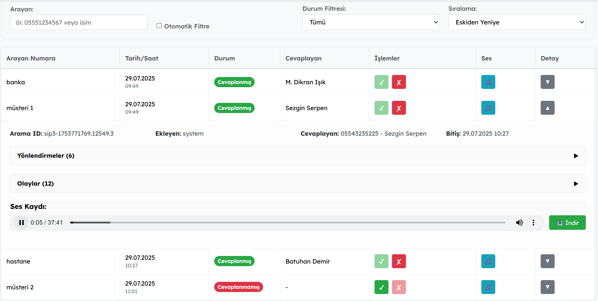

# Arama Kontrol Sistemi

Stajım sırasında telefon aramalarını takip etmek ve yönetmek amacıyla Arjeta şirketi için geliştirdiğim modern bir web uygulaması. NetGSM API entegrasyonu ile gerçek zamanlı arama kayıtları ve durum takibi sağlar.

## 🚀 Özellikler

- **Gerçek Zamanlı Arama Takibi**: NetGSM webhook entegrasyonu ile anlık arama bilgileri
- **Akıllı Filtreleme**: Numara ve isim bazlı arama, durum filtreleme
- **Otomatik Sıralama**: Cevaplanmamış aramaları öncelikle görüntüleme
- **Sayfalama**: Performanslı veri görüntüleme
- **Ses Kayıtları**: Arama kayıtlarını indirme ve dinleme
- **Kullanıcı Yönetimi**: JWT tabanlı kimlik doğrulama
- **Responsive Tasarım**: Mobil ve desktop uyumlu arayüz

## 📋 Gereksinimler

- Go 1.19+
- PostgreSQL 12+
- NetGSM API hesabı

## 🛠️ Kurulum

### Backend Kurulumu

1. Depoyu klonlayın:
```bash
git clone <repository-url>
cd arama-kontrol
```

2. Go modüllerini yükleyin:
```bash
go mod download
```

3. Ortam değişkenlerini ayarlayın:
```bash
cp .env.example .env
# .env dosyasını düzenleyin
```

4. Uygulamayı çalıştırın:
```bash
go run cmd/server/main.go
```

## 🔧 Konfigürasyon

### Ortam Değişkenleri

```env
# Veritabanı
DB_HOST=localhost
DB_PORT=5432
DB_USER=your_username
DB_PASSWORD=your_password
DB_NAME=arama_kontrol

# Server
PORT=3000
ORIGIN=http://localhost:3000

# JWT
JWT_SECRET=your_jwt_secret
```

### NetGSM Webhook Konfigürasyonu

NetGSM panelinden webhook URL'ini ayarlayın:
```
https://yourdomain.com/api/calls/callback
```

## 📱 Kullanım

### Arama Listesi



Arama listesinde:
- Arayan numara ve isim bilgileri
- Arama durumu (cevaplanmış/cevaplanmamış)
- Yönlendirme bilgileri
- Ses kayıtları

### Filtreleme ve Arama



Gelişmiş filtreleme özellikleri:
- Numara veya isme göre arama
- Durum bazlı filtreleme
- Tarih aralığı seçimi
- Otomatik sıralama

### Ses Kayıtları



Ses kayıtları:
- Otomatik indirme ve kaydetme
- Web üzerinden dinleme
- Kayıt kalitesi ve süre bilgileri

## 🏗️ Proje Yapısı

```
arama-kontrol/
├── cmd/
│   └── app/                # Sunucu
├── internal/
│   ├── handlers/           # HTTP handler'ları
│   ├── dal/                # Veri erişim katmanı
│   └── middleware/         # Middleware'ler
├── pkg/
│   ├── database/           # Veritabanı bağlantısı
│   └── file/               # Dosya işlemleri
├── frontend/               # React frontend
└── uploads/                # Yüklenen dosyalar
```

## 📡 API Endpoints

### Kimlik Doğrulama
- `POST /api/auth/login` - Kullanıcı girişi
- `POST /api/auth/register` - Kullanıcı kaydı

### Aramalar
- `GET /api/calls` - Arama listesi (sayfalama, filtreleme)
- `POST /api/calls/callback` - NetGSM webhook
- `PUT /api/calls/:id/:status` - Arama durumu güncelleme

### Numaralar
- `GET /api/numbers` - Kayıtlı numaralar
- `POST /api/numbers` - Yeni numara ekleme
- `DELETE /api/numbers/:id` - Numara silme

## 🔒 Güvenlik

- JWT tabanlı kimlik doğrulama
- Middleware ile rota koruması
- SQL injection koruması
- CORS konfigürasyonu

## 📊 Veritabanı Şeması

### Ana Tablolar
- `users` - Kullanıcı bilgileri
- `calls` - Arama kayıtları
- `numbers` - Numara-isim eşleştirmesi
